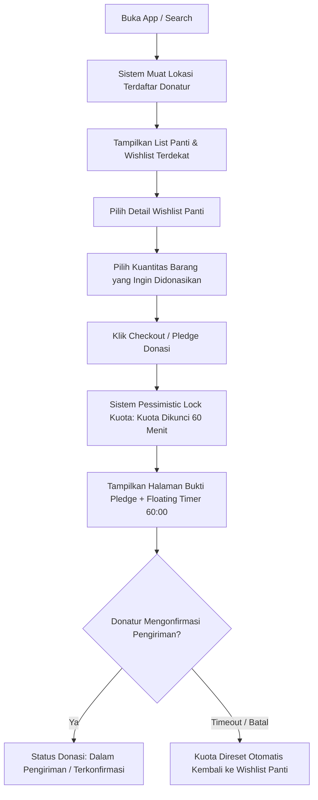
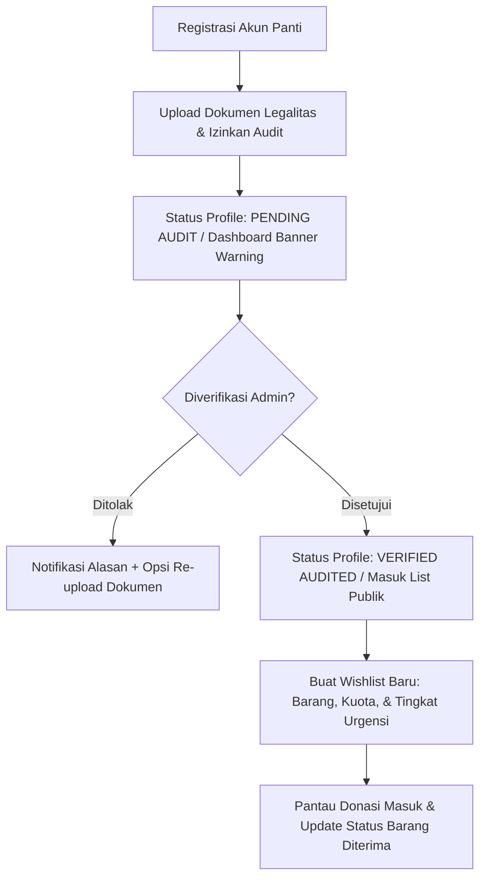
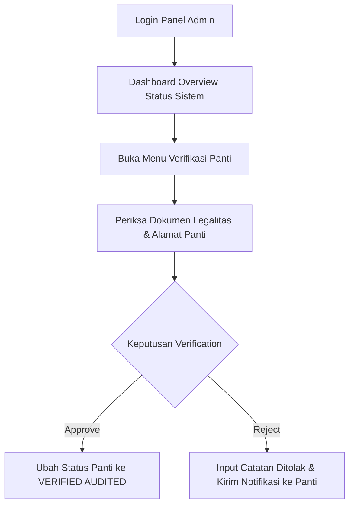

# Panduan & Spesifikasi UX (UX Design Guidelines) — KawanBerbagi

Dokumen ini merupakan panduan dan standar pengalaman pengguna (*User Experience*) resmi untuk platform **KawanBerbagi** ("Pasar Terbalik" Platform Donasi Demand-Driven). Dokumen ini mengintegrasikan prinsip psikologi UX modern, alur pengguna (*User Flow*), serta sistem visual *Editorial-Brutalist / Bento Grid* dari [DESIGN.md](file:///c:/Users/ACER/Desktop/Kuliah/Lomba/SoftDev/CODE%206.0/KawanBerbagi/DESIGN.md).

---

## 1. Konteks Proyek

* **Nama Proyek:** KawanBerbagi ("Pasar Terbalik" Demand-Driven Donation Platform)
* **Tujuan Utama:** Mencegah *oversupply* (kelebihan pasokan) barang di panti asuhan dengan mekanisme pencocokan kebutuhan spesifik (*wishlist & kuota*) berbasis lokasi terdaftar donatur serta penguncian kuota transaksional (*Pessimistic Lock / 60-Minute Lock Timer*).
* **Target Pengguna:**
  1. **Donatur:** Masyarakat umum, komunitas, maupun donatur individu yang ingin menyalurkan bantuan barang/dana secara transparan dan terukur.
  2. **Panti Asuhan / Yayasan:** Pengelola panti asuhan (penerima manfaat) yang memerlukan pemenuhan kebutuhan barang spesifik (makanan, alat tulis, pakaian, dll.).
  3. **Administrator:** Pengelola platform yang memverifikasi legalitas panti, mengawasi transaksi donasi, dan memoderasi konten kampanye.
* **Platform:** Web Responsive (Desktop & Mobile-First, dengan zona jangkauan jempol untuk tampilan seluler).

---

## 2. Aturan Fundamental Psikologi UX & Bento Design System

### A. Hukum Psikologi UX
* **Hukum Jakob (Konvensi Tata Letak Standard):**
  * Elemen navigasi ditempatkan di lokasi standar industri (Logo di kiri atas, menu navigasi di tengah/kiri, profil & notifikasi di kanan atas).
  * Pada tampilan seluler (*mobile*), tombol aksi utama (*CTA / Checkout*) berada di bagian bawah (*Thumb Zone*) agar mudah dijangkau satu tangan.
* **Hukum Hick (Beban Kognitif Minimal):**
  * Pembagian informasi menggunakan pola **Bento Box Grid**: setiap modul dibatasi garis border tegas (`border-dark` `#083A4F`) tanpa celah (*gutter 0px*), memicu rasa rapi ala arsip resmi.
  * Formulir kompleks (seperti Registrasi & Legalitas Panti, atau Checkout Donasi) dipecah menjadi proses bertahap (*Multi-step Wizard / Stepper*) maksimal 3-4 kolom per langkah.

### B. Integrasi Visual Design System (Editorial Brutalism)
* **Sudut Siku (Border Radius 0px):** Semua kartu, tombol, input, dan modul bento memiliki sudutiku siku (`rounded-none`). Pengecualian hanya untuk *pill/dot status indicator* (`rounded-full`).
* **Kontras Warna Struktural:**
  * Dominan: Teal Gelap (`#002433` & `#083A4F`) dan Krem Warm Off-White (`#E5E1DD` & `#FDF9F4`).
  * Aksen Tag/Status: Ochre Gold (`#A58D66`) untuk overline tag uppercase (misal: `ARCHIVE STATUS: ACTIVE`).
* **Data-First Visual Hierarchy:** Angka kuota, persentase pemenuhan, dan status verifikasi ditampilkan dengan ukuran font besar dan *bold/heavy weight* (Inter 700-900).

---

## 3. Interaksi & Pemuatan (Loading & State Management)

### A. Waktu Respon & Feedback Visual
1. **Aturan < 1 Detik (Optimistic UI):** Untuk aksi sederhana seperti *bookmarking*, menyaring kategori (*filter tab*), atau mencentang item, perbarui UI secara langsung tanpa menunggu respon API. Jika API gagal, kembalikan state secara halus (*rollback*) dengan notifikasi *toast*.
2. **Skeleton Screens (2-5 Detik):**
   * Gunakan Bento Skeleton Block (kotak ber-border dengan animasi pulsa bernuansa `#C0D5D6`) yang mempertahankan tata letak bento asli saat memuat daftar panti atau wishlist.
   * **Dilarang** membiarkan halaman bergeser (*layout shift / CLS*) saat data selesai dimuat.
3. **Inline Spinner & Progress Bar (> 5 Detik):**
   * Gunakan *inline spinner* di dalam tombol untuk proses penguncian kuota / submit form.
   * Untuk proses unggah dokumen legalitas panti, wajib gunakan *Flat Progress Bar* (`h-3 bg-btn-primary`) berpersentase akurat.

### B. Graceful Degradation (Ketahanan Modul)
* Setiap kartu dalam Bento Grid dirancang secara independen. Jika modul peta/lokasi gagal dimuat, modul *Wishlist Urgen* dan *Ringkasan Panti* tetap beroperasi normal tanpa menyebabkan *crash* seluruh halaman.

---

## 4. Desain Formulir (Form Input UX)

1. **Validasi Inline Real-Time:**
   * Umpan balik validasi (centang hijau / border merah) muncul segera setelah fokus berpindah dari kolom (*blur event*) atau pengguna selesai mengetik.
2. **Lokasi Terdaftar Donatur (Default UX):**
   * Sistem pencarian wishlist secara otomatis menggunakan **lokasi profil terdaftar donatur** sebagai default pencarian tanpa memunculkan pop-up izin lokasi berulang kali. Sediakan opsi tombol *Filter / Ubah Lokasi* jika donatur ingin mencari di area lain.
3. **Status Tombol Aksi (Submit / Checkout):**
   * Tombol *Submit* tetap dalam kondisi *disabled* (opacity 50%, kursor `not-allowed`) hingga seluruh data wajib diisi secara valid. Indikator syarat yang belum terpenuhi ditampilkan dalam teks pembantu (*helper text*).
4. **Toleransi Input & Formatter:**
   * Kolom nomor telepon otomatis merapikan input pengguna (menghapus spasi, strip, atau mengubah `08...` menjadi format standar).
   * Kolom kuantitas barang menyediakan tombol pemilih angka `+` dan `-` cepat beserta teks batasan sisa kuota (misal: "Maksimal 15 unit lagi").

---

## 5. Penanganan Kesalahan (Error Handling)

| Tingkat Kesalahan | Komponen UX | Penanganan Visual & Aksi |
|---|---|---|
| **Form Input Error** | Inline Field Error | Teks merah (`#BA1A1A`) di bawah kolom terkait + garis border merah solid. |
| **Sistem / Jaringan Non-Kritis** | Toast Notification | Banner *toast* kecil di pojok kanan atas, auto-dismiss dalam 4 detik ("Jaringan lambat, mencoba merefresh data..."). |
| **Timeout Kuota / Pembayaran** | Bento Modal Window | Pop-up dialog tengah layar ber-border solid `#083A4F`. Menjelaskan bahwa masa penguncian kuota (60 menit) telah habis dan menyediakan tombol CTA `[Perbarui Kuota]` atau `[Kembali ke Wishlist]`. |

---

## 6. Standardisasi Empty States (Kondisi Kosong)

Setiap bagian yang belum memiliki data wajib menggunakan **Integrated Bento-Box Empty State** dengan struktur berikut:
* **Border & Layout:** Modul bento dengan border solid `#083A4F` dan background `#FDF9F4`.
* **Overline Tag:** `STATUS: KOSONG` atau `DATA TIDAK DITEMUKAN` dalam format UPPERCASE `font-bold tracking-widest text-accent-ochre`.
* **Ikonografi:** Ikon Material Symbols (misal `inbox`, `search_off`, `location_off`) ukuran 48px.
* **Teks Deskripsi:** Pesan edukatif 1-2 kalimat (contoh: "Belum ada panti asuhan yang merilis wishlist di lokasi ini. Coba perluas jangkauan pencarian Anda.").
* **Tombol CTA Aksi:** Tombol tegas untuk menyelesaikan masalah (contoh: `[Reset Filter Lokasi]` atau `[Buat Wishlist Baru]`).

---

## 7. Status Keberhasilan (Success States & Audit Trail)

1. **Aksi Kecil (Bookmark / Simpan Draf):** Transisi ikon `check` berwarna teal + notifikasi *toast* non-intrusif.
2. **Aksi Transaksional Utama (Checkout Pledge Donasi / Submit Wishlist):**
   * Tampilkan **Halaman Konfirmasi Transaksi (Live Ledger Confirmation)** penuh yang menyerupai sertifikat/bukti arsip resmi.
   * Sertakan Nomor Kode Donor/Pledge, Rincian Barang & Kuota yang Dikunci, Timer Hitung Mundur Pengiriman (60 Menit / 1 Jam), serta Instruksi Pengiriman / Kontak Panti.

---

## 8. Skenario User Flow Peran Utama

### Flow 1: Donatur — Discovery, Lock Quota (60m Countdown) & Checkout Donasi


### Flow 2: Panti Asuhan — Upload Legalitas, Verifikasi & Kelola Wishlist


### Flow 3: Admin — Verifikasi Legalitas & Moderasi Kampanye


---

## 9. Detail Komponen & Wireframe Layout (Bento Grid)

### A. Wireframe Halaman Detail Wishlist & Checkout Donatur
```
+-----------------------------------------------------------------------------------+
| NAVBAR: [KAWANBERBAGI]         [Cari Panti]  [Riwayat Donasi]     (Profil Donatur) |
+-----------------------------------------------------------------------------------+
| OVERLINE: DETAIL KEBUTUHAN PANTI | LOCATION: TANGERANG (JARAK: 2.4 KM)             |
+-----------------------------------------------------------------------------------+
| [COL-8: INFORMASI PANTI & WISHLIST]            | [COL-4: PANEL LOCK QUOTA / PLEDGE] |
| +--------------------------------------------+ | +------------------------------+ |
| | PANTI ASUHAN KASIH IBU                      | | | TIMER TERKUNCI: 59:54        | |
| | Status: [VERIFIED AUDITED]                 | | | (Floating Timer Highlight)   | |
| |                                            | | |                              | |
| | Kebutuhan Urgen:                           | | | Pilih Kuantitas Donasi:      | |
| | [x] Beras Cap Ramos - 50 kg (Sisa 10 kg)   | | | [-] [ 5 ] kg [+]             | |
| | [ ] Seragam Sekolah SD - 15 Pasang         | | | (Maksimum 10 kg lagi)        | |
| |                                            | | |                              | |
| | Progress Kebutuhan Total:                  | | | [ TOMBOL COMMIT / CHECKOUT ] | |
| | [===============>--------] 65% Terpenuhi   | | | (Solid Teal Button)          | |
| +--------------------------------------------+ | +------------------------------+ |
+-----------------------------------------------------------------------------------+
| LIVE LEDGER (RIWAYAT DONATUR TERAKHIR):                                            |
| [2026-07-20 | Donatur A | 10kg Beras] | [2026-07-20 | Donatur B | 5 Pasang Seragam]  |
+-----------------------------------------------------------------------------------+
```

### B. Wireframe Dashboard Panti (Verifikasi Pending State)
```
+-----------------------------------------------------------------------------------+
| BANNER WARNING AUDIT (BG: OCHRE/AMBER, BORDER: DARK)                               |
| [!] STATUS AKUN: PENDING VERIFIKASI. Panti Anda belum dapat menerima donasi publik. |
|     Silakan lengkapi dokumen Surat Izin Operasional & Akta Yayasan. [Upload File] |
+-----------------------------------------------------------------------------------+
| BENTO GRID MANAGEMENT:                                                            |
| +---------------------------------------+ +-------------------------------------+ |
| | [MODUL 1: KELOLA WISHLIST BARU]       | | [MODUL 2: DONASI MASUK / PLEDGE]  | |
| | Form Input Barang, Kuota & Urgensi   | | Tabel Donatur, Timer & Status     | |
| +---------------------------------------+ +-------------------------------------+ |
+-----------------------------------------------------------------------------------+
```

### C. Wireframe Admin Verification Panel
```
+-----------------------------------------------------------------------------------+
| OVERLINE: ADMIN VERIFICATION CONSOLE | PENDING AUDITS: 3 PANTI                     |
+-----------------------------------------------------------------------------------+
| TABEL DOKUMEN VERIFIKASI (EDITORIAL ZEBRA PATTERN):                                |
| +--------------------+------------------+-------------------+-------------------+ |
| | NAMA PANTI         | TGL DAFTAR       | DOKUMEN LEGALITAS | AKSI VERIFIKASI   | |
| +--------------------+------------------+-------------------+-------------------+ |
| | Panti Kasih Ibu    | 2026-07-19       | [Lihat SIOP.pdf]  | [APPROVE] [REJECT]| |
| | Yayasan Tunas Hijau| 2026-07-18       | [Lihat Akta.pdf]  | [APPROVE] [REJECT]| |
| +--------------------+------------------+-------------------+-------------------+ |
+-----------------------------------------------------------------------------------+
```

---

## 10. Ringkasan Prinsip Pengujian UX (UX Verification Checklist)

- [x] **Zero Layout Shift:** Skeleton screens digunakan saat fetching data, tidak ada pergeseran posisi tombol/modul saat data selesai dimuat.
- [x] **Location Graceful UX:** Lokasi terdaftar profil donatur digunakan secara default tanpa hambatan pop-up GPS berulang.
- [x] **Transactional Locking Visibility:** Timer 60 menit penguncian kuota ditampilkan secara menonjol di panel checkout donatur agar kuota tidak hangus tanpa disadari.
- [x] **Verification Gating:** Panti unverified secara tegas diisolasi dari daftar pencarian publik hingga status berubah menjadi `VERIFIED AUDITED`.
- [x] **Bento Visual Consistency:** Bebas sudut melengkung (*0px border-radius*), pemisah modul menggunakan *border-dark* `#083A4F`, dan tipografi *uppercase overline* pada seluruh komponen visual.